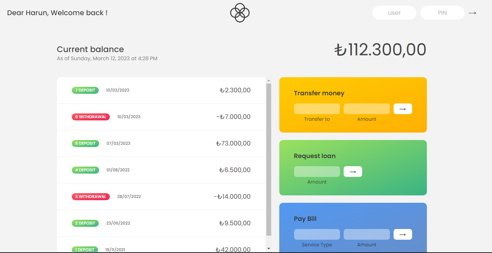

## **<h2 align="center"> Online Bank Application   💻</h2>**

#  💵 Simple Digital Bank

<h1 align="center">
    
</h1>

# Important
## :key: How to Login

💡 User : hb  
   Password : 1111

💡 User : jb  
  Password : 2222

💡 User : em  
  Password : 3333

💡 User : ho  
  Password : 2222

---

:key: Take a look --> https://hariyebk.github.io

## :rocket: Technologies used:

You can use any tools you like to help you complete the challenge. So if you've got something you'd like to practice, feel free to give it a go.

---

## ⭐ Features
- [x] Login, Logout
- [x] Transfer money
- [x] supports international currencies
- [x] Pay Bill
- [x] request loan
- [x] close account

## Rules

#### ⚠️You can only pay wifi , electric , water and tax bills.
#### ⚠️ In order to get a loan , the account should have at least 55% of the requested loan. and the deposit frequency of the account should be 1.5 times greater than the withdrawl frequency.
#### ⚠️You can't transfer money to your self .

---

## About

this project was developed in The Complete JavaScript Course 2021: From Zero to Expert! couse.
https://www.udemy.com/course/the-complete-javascript-course/

Created by ** Jonas Schmedtmann **  
Developed by ** Harun Bekri **
